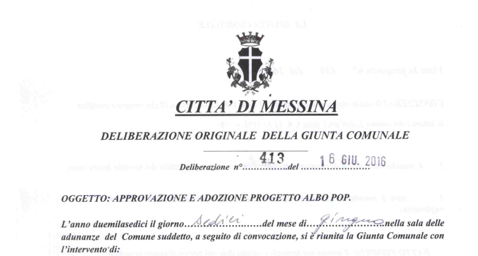
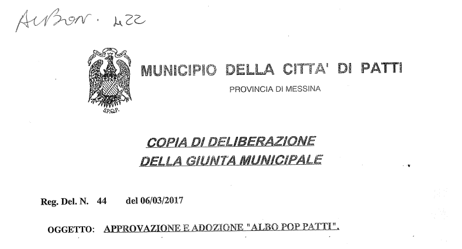
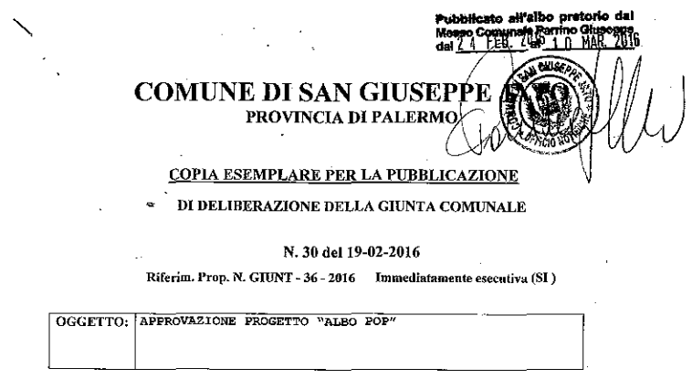
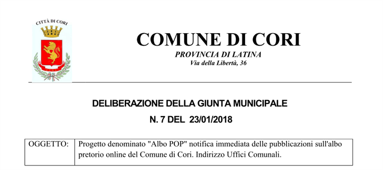

Alcune **pubbliche amministrazioni** hanno scelto di essere "**ufficialmente POP**" e hanno deliberato formalmente la creazione e l'uso dell'albo pretorio POP:

<!-- TOC -->

- [Comune di Messina](#comune-di-messina)
- [Comune di Patti (Messina)](#comune-di-patti-messina)
- [Comune di San Giuseppe Jato (Palermo)](#comune-di-san-giuseppe-jato-palermo)
- [Comune di Cori (Latina)](#comune-di-cori-latina)

<!-- /TOC -->

## Comune di Messina

## Comune di Patti (Messina)

## Comune di San Giuseppe Jato (Palermo)

## Comune di Cori (Latina)

